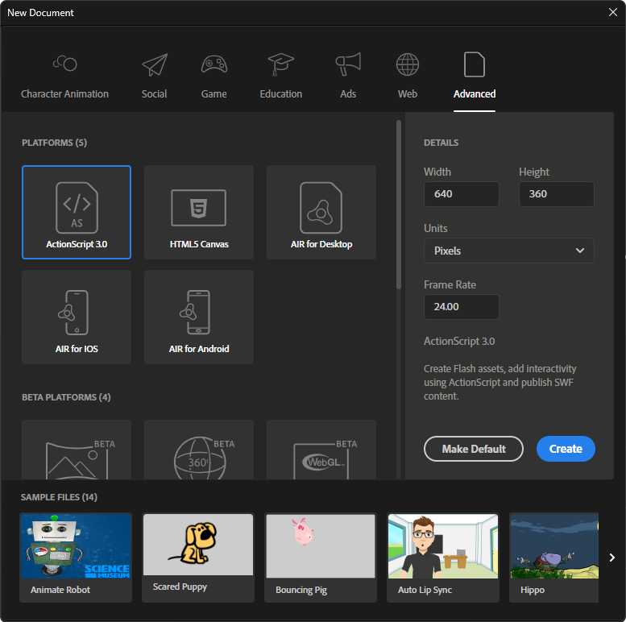
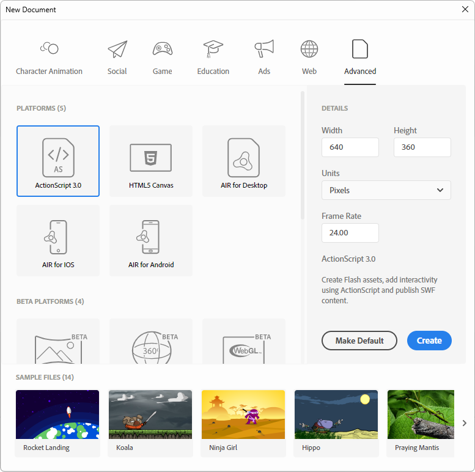
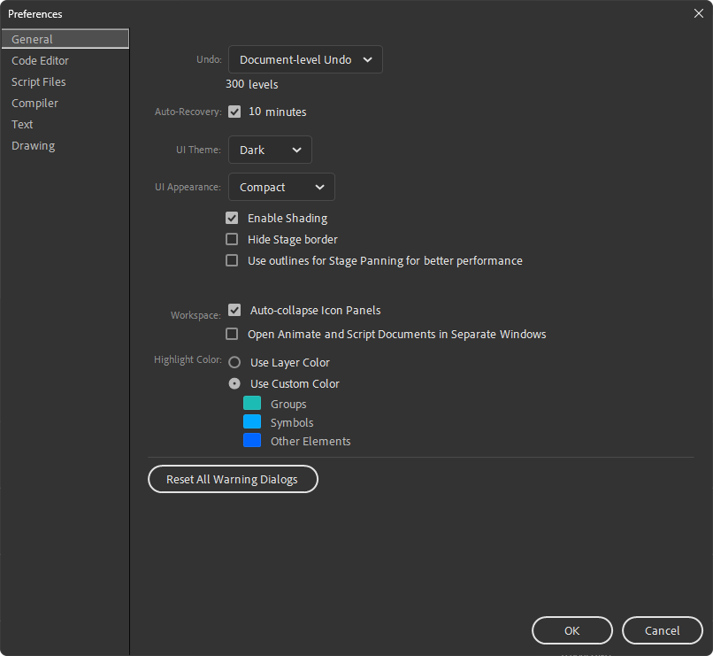
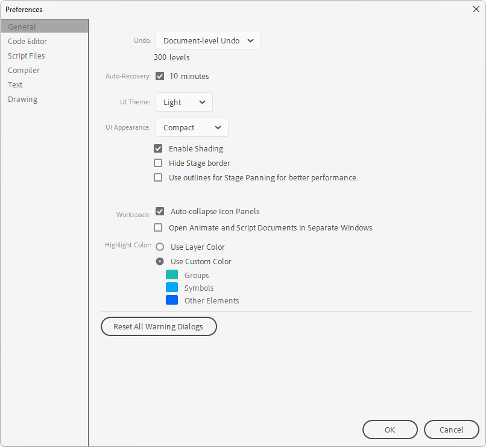
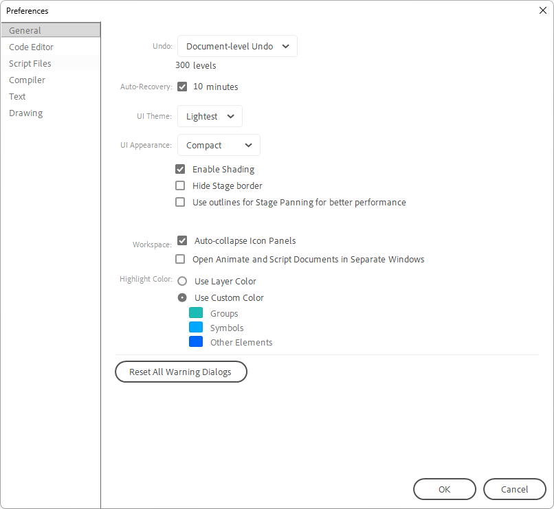
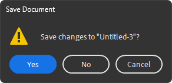
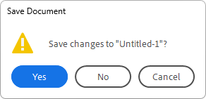

<div align="center">

# animate11

<q>make Animate ***trully* immersive**!</q>

This addon colors **all titlebars** in Adobe Animate the same as their windows
</div>

<div align="center">
    <h2>animate 11 supports:</h2>
    <details>
        <summary><q><b>New Document</b></q> dialog</summary>
        <br>
        <blockquote><b>Note</b>: this dialog <b>explicitly</b> has only <b>2 variants</b></blockquote>
        <table>
            <tr>
                <th>Dark & Darkest</th>
                <th>Light & Lightest</th>
            </tr>
            <tr>
                <td></td>
                <td></td>
            </tr>
        </table>
    </details>
    <details>
        <summary><q><b>Settings</b></q> dialog</summary>
        <br>
        <table>
            <tr>
                <th>Dark</th>
                <th>Darkest</th>
            </tr>
            <tr>
                <td></td>
                <td></td>
            </tr>
            <tr>
                <th>Light</th>
                <th>Lightest</th>
            </tr>
            <tr>
                <td></td>
                <td></td>
            </tr>
        </table>
    </details>
    <details>
        <summary><q><b>Save Changes</b></q> dialog</summary>
        <br>
        <table>
            <tr>
                <th>Darkest</th>
                <th>Dark</th>
                <th>Light</th>
                <th>Lightest</th>
            </tr>
            <tr>
                <td></td>
                <td></td>
                <td></td>
                <td></td>
            </tr>
        </table>
    </details>
    <span>and <b>all</b> the other dialogs in Adobe Animate!</span>
</div>

## Releases
> **Warning** **pre-releases** might contain **critical bugs**!
- [**0.1.2** <sup>latest</sup>](https://github.com/DeMineArchiver/animate-test-addons/releases/tag/animate11-v0.1.2 "animate11-v0.1.2") (pre-release)
- [**0.1.0**](https://github.com/DeMineArchiver/animate-test-addons/releases/tag/animate11-v0.1.0 "animate11-v0.1.0") (pre-release)

- [**0.0.1**](https://github.com/DeMineArchiver/animate-test-addons/releases/tag/animate11-v0.0.1 "animate11-v0.0.1") (pre-release)

## Installation
### System Requirements
- **Windows 11 21H2** or newer
- **Adobe Animate 2020** or newer
### Installation via PowerShell
```powershell
[Net.ServicePointManager]::SecurityProtocol = [Net.SecurityProtocolType]::Tls12; Invoke-Expression "& { $(Invoke-WebRequest -UseBasicParsing 'https://raw.githubusercontent.com/DeMineArchiver/animate-test-addons/master/scripts/install.ps1') } -Addon animate11"
```
### See [**# Installation**](https://github.com/DeMineArchiver/animate-test-addons#Installation "github.com/DeMineArchiver/animate-test-addons")